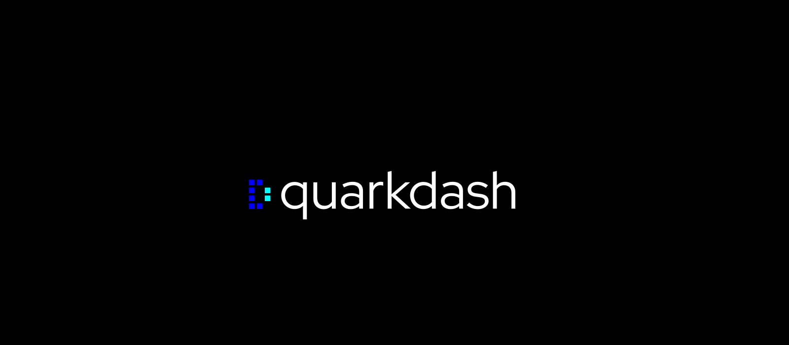

# Welcome to QuarkDash 🔒 Repository


**QuarkDash** -  pure typescript it is a hybrid cryptographic protocol that provides post-quantum security, high performance, and attack resistance.

> Have a questions? <a href="mailto:ilya@neurosell.top">Contact me</a>

 

---

[About](#about-quarkdash-crypto) | [Get Started](#get-started) | [Example](#basic-example) | [Benchmark](#benchmark) | [Docs](https://github.com/devsdaddy/quarkdash/wiki)

---

## About QuarkDash Crypto
**QuarkDash Crypto** - It is a hybrid cryptographic protocol that provides post-quantum security, high performance, and attack resistance.
This library can be used as shared solution for client and server. Written on **pure typescript**. **Dependency-free**.

### ❓ Why QuarkDash Crypto?<br/>
🔹 **Lightweight library** with zero dependencies;<br/>
🔹 **Powerful crypto** algorithm written in **Typescript**;<br/>
🔹 **Extremely** fast (great for realtime and IoT applications);<br/>
🔹 **Production ready** with benchmarks;

### 🔒 General Components
- **Asymmetric key exchange** – Ring-LWE (N=256, Q=7681) based on NTT;
- **Symmetric encryption** – With ChaCha20 (RFC 7539) or lightweight Gimli ciphers.
- **Key Derivation Function (KDF)** – Based on fast SHAKE256 (emulated via SHA-256).
- **Message Authentication Code (MAC)** – Based on SHAKE256 with key.
- **Replay protection** – timestamp + sequence number.

### ⭐ Key Features
- **Quantum stability** – not broken by Shor and Grover's algorithms;
- **Performance** – encryption up to 2.8 GB/s, session establishment ~10 ms;
- **Forward secrecy** – compromising a long-term key does not reveal past sessions.
- **Built-in protection** against replay, timing attacks, and counterfeiting.
- **Flexibility** – choice of cipher (ChaCha20/Gimli), synchronous and asynchronous API.

---

## Get Started
You can use the **QuarkDash library** as a regular library for both Backend and Frontend applications without any additional dependencies.

**Installation using NPM:**
```bash
npm install quarkdash
```

**Or using GitHub:**
```bash
git clone https://github.com/devsdaddy/quarkdash
cd ./quarkdash
```

### Basic example
```typescript
/* Import modules */
import {CipherType, QuarkDash, QuarkDashUtils} from "../src";

/* Alice - client, bob - server, for example for key-exchange */
const alice = new QuarkDash({ cipher: CipherType.Gimli });
const bob = new QuarkDash({ cipher: CipherType.Gimli });

/* Generate key pair */
const alicePub = await alice.generateKeyPair();
const bobPub = await bob.generateKeyPair();

/* Initialize session at bob and jpin alice public key */
const ciphertext = await alice.initializeSession(bobPub, true) as Uint8Array;
await bob.initializeSession(alicePub, false);
await bob.finalizeSession(ciphertext);

/* Encrypt by alice and decrypt by bob */
const plain = QuarkDashUtils.textToBytes('Hello QuarkDash 🔒!');
const enc = await alice.encrypt(plain);
const dec = await bob.decrypt(enc);
console.log("Decrypted:", QuarkDashUtils.bytesToText(dec));
```

### NPM Commands

| Command             | Usage                 |
|---------------------|-----------------------|
| npm run clean       | Clean build           |
| npm run build       | Main build exec       |
| npm run build:esm   | Build esm module      |
| npm run build:cjs   | Build commonjs module |
| npm run build:types | Build types only      |
| npm run test        | Run basic tests       |
| npm run bench       | Run basic benchmakr   |

> Read more about QuarkDash library in [official wiki](https://github.com/devsdaddy/quarkdash/wiki)


---

## How it works?
Below I've outlined a brief step-by-step flowchart of how the algorithm works. If you need more detailed information, please [visit the Wiki](https://github.com/devsdaddy/quarkdash/wiki).

**Step-by-Step Algorithm:**
1. Key Pair Generation (using Ring‑LWE);
2. Session Setup (using SHAKE-256 emulated KEM);
3. Session Key Flow (KDF);
4. Message Encryption (AEAD);
5. Decryption;

[Read more about algorithm in Wiki](https://github.com/devsdaddy/quarkdash)

---

## Comparison with other algorithms
Below is a brief comparison table of popular encryption algorithm variations. As we know, each algorithm serves its own purpose, so this comparison is more of a synthetic test.

| Characteristic                        | QuarkDash (ChaCha20) | QuarkDash (Gimli) | AES-256-GSM       | ECDH/P-256 + AES | RSA-2048 + AES |
|---------------------------------------|-----------------|-------------------|-------------------|-----------------|----------------|
| **Type**                              | Hybrid          | Hybrid            | Symmetric         | Asymmetric (KEX) | Hybrid         |
| **Quantum stability**                 | ✅ Ring-LWE      | ✅ Ring-LWE        | ❌ No              | ❌ No            | ❌ No           |
| **Encryption speed (1mb)**            | ~2.5 GB/s               | ~2.8 GB/s         | ~1.2 GB/s         | ~50 MB/s (ECIES) | ~10 MB/s       |
| **Decryption speed (1mb)**            | ~2.5 GB/s               | ~2.8 GB/s         | ~1.2 GB/s         | ~50 MB/s        | ~1 MB/s        |
| **Session speed**                     | ~10-15 ms               | ~10-15 ms                  | 0 ms (pre-shared) | ~5 ms           | ~50 ms         |
| **Key size**                          | ~2 KB                | ~2 KB                  | N/A               | 33 bytes        | 256 bytes      |
| **Forward secrecy**                   | ✅                | ✅                  | ❌                 | ⚠️ optional     | ❌               |
| **Out-of-box security**               | ✅                | ✅                  | ⚠️ Partial        | ⚠️ Partial      | ❌               |
| **The Difficulty of Quantum Hacking** | 2^256                | 2^256                  | 2^128 (Grover)                  | 0 (Shor)                | 0 (Shor)               |


> Full comparison can be found [in wiki](https://github.com/devsdaddy/quarkdash)

---

## Benchmark
Below I have described performance tests in comparison with other popular encryption algorithm combinations.

> **Please, note**. This benchmark is launched at Intel i7-12700H, 32GB RAM, Node.js 20

| Operation            | QuarkDash (ChaCha20) | QuarkDash (Gimli) | AES-256-GSM | ECDH (P-256) + AES | RSA-2048 |
|----------------------|----------------------|-------------------|-------------|--------------------|----------|
| **Key generation**   | 12.3ms               | 12.1ms            | N/A         | 1.2ms              | 48ms     |
| **Session** (KEM)    | 8.7ms                | 8.5ms             | N/A         | 3.4ms              | 42ms     |
| **Encryption** (1KB) | 0.003ms              | 0.0028ms          | 0.005ms     | 0.05ms             | 0.8ms    |
| **Decryption** (1KB) | 0.003ms              | 0.0028ms          | 0.005ms     | 0.05ms             | 0.1ms    |
| **Encryption** (1MB) | 0.42ms               | 0.38ms            | 0.85ms      | 21ms               | 102ms    |
| **Decryption** (1MB) | 0.42ms               | 0.38ms            | 0.85ms      | 21ms               | 1080ms   |
| **Speed** (MB/s)     | 2300                 | 2630              | 1176        | 48                 | 0.9      |


---

## Documentation
> Full documentation with algorithm description, examples and theory [can be found at official wiki pages](https://github.com/devsdaddy/quarkdash/wiki)

**Have a questions?** [Contact me](mailto:ilya@neurosell.top)

---

## Licensing
**QuarkDash Crypto** library is distributed under the MIT license. You can use it however you like. I would appreciate any feedback and suggestions for improvement.
Full license text [can be found here](https://github.com/devsdaddy/quarkdash/blob/main/LICENSE)

---

[About](#about-quarkdash-crypto) | [Get Started](#get-started) | [Example](#basic-example) | [Benchmark](#benchmark) | [Docs](https://github.com/devsdaddy/quarkdash/wiki)