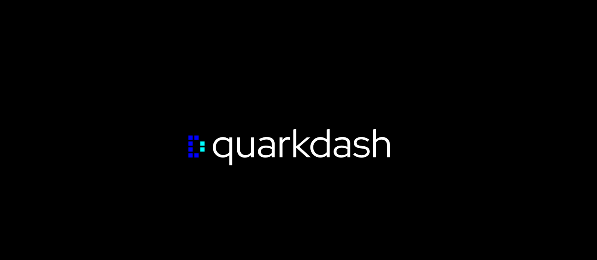

# Welcome to QuarkDash 🔒 Repository
### Current version: 1.2.1 LTS (August 2026)


**QuarkDash** -  pure typescript it is a hybrid cryptographic protocol that provides post-quantum security, high performance, and attack resistance.

> Have a questions? <a href="mailto:ilya@neurosell.top">Contact me</a>

 

> Now available for [Go applications / servers](https://github.com/DevsDaddy/quarkdash-go)

---

[Paper](whitepaper.pdf) | [About](#about-quarkdash-crypto) | [Get Started](#get-started) | [Example](#basic-example) | [Benchmark](#benchmark) | [Docs](https://github.com/devsdaddy/quarkdash/wiki) | [Scheme](https://app.holst.so/share/b/7ae942f8-8a40-42c9-9991-3b624f147da8)

---

## About QuarkDash Crypto
**QuarkDash Crypto** - It is a hybrid cryptographic protocol that provides post-quantum security, high performance, and attack resistance.
This library can be used as shared solution for client and server. Written on **pure typescript**. **Dependency-free**.

> Algorithm Scheme [can be found here](https://app.holst.so/share/b/7ae942f8-8a40-42c9-9991-3b624f147da8)

**[Read full paper](whitepaper.pdf)**

### ❓ Why QuarkDash Crypto?<br/>
🔹 **Lightweight library** with zero dependencies;<br/>
🔹 **Powerful crypto** algorithm written in **Typescript**;<br/>
🔹 **Extremely** fast (great for realtime and IoT applications);<br/>
🔹 **Production ready** with benchmarks;

### 🔒 General Components
- **Asymmetric key exchange**: Ring-LWE (N=256, Q=7681, ROOT=5685) / R-Ring-LWE (Q=12289, ROOT=8340) with hardened NTT + 1-bit per-coeff reconciliation hint (ciphertext 544 B, backward-compatible with 512 B);
- **Symmetric encryption**: ChaCha20 (RFC 7539) or lightweight Gimli with **lazy keystream generation**;
- **Key Derivation Function (KDF)**: SHAKE256 + HKDF-style expand (fixed, loop bug fixed, deterministic zero-salt for session);
- **Message Authentication Code (MAC)**: SHAKE256(key‖data) 32 B, constant-time verify, `signTwo` zero-copy;
- **Hash**: SHA-256 / SHA-512 (padding & length fixed for 55/56 and 111/112 edge blocks) and SHAKE-256 (Keccak-f from `js-sha3`, correct domain separation `0x1F`/`0x80`, empty-input & multi-block squeeze, C/WASM synced);
- **Replay protection**: timestamp + sequence number + sliding window;
- **Passphrase KDF**: PBKDF2-HMAC-SHA256 / Argon2id-lite;
- **Transports**: WebSocket / HTTP / gRPC integrations.

### ⭐ Key Features
- **Quantum stability**: not broken by Shor and Grover's algorithms;
- **Performance**: encryption up to 2.8 GB/s, session establishment ~10 ms;
- **Forward secrecy**: compromising a long-term key does not reveal past sessions;
- **Lazy keystream**: seekable, cached, zero-copy XOR via `ChaChaKeystream` / `GimliKeystream`;
- **Re-keying (Key rotation)**: `rekey()` / `applyRekey()` with policy by bytes / messages / time limit (order fixed: encrypt-then-derive);
- **Passphrase**: Human-readable `pbkdf2` / `argon2id` lite keys and `generateSalt()`;
- **Hardened Secured NTT**: blinding, double-check, constant-time, polynome validation, correct primitive roots, bit-reversed Cooley-Tukey and cross-rounding hint;
- **Transports**: native simple wrappers for `WebSocket` / `gRPC` / `HTTP` transport;
- **Flexibility** – ChaCha20/Gimli, sync and async API, per-message nonce;

---

## Get Started

You can use the **QuarkDash library** as a regular library for both Backend and Frontend applications without any additional dependencies.

**Installation using NPM:**

```bash
npm install quarkdash
```

**Or using GitHub:**

```bash
git clone https://github.com/devsdaddy/quarkdash
cd ./quarkdash
```

### Basic example

```typescript
/* Import modules */
import { CipherType, QuarkDash, QuarkDashUtils } from "../src";

/* Alice - client, bob - server, for example for key-exchange */
const alice = new QuarkDash({ cipher: CipherType.Gimli });
const bob = new QuarkDash({ cipher: CipherType.Gimli });

/* Generate key pair */
const alicePub = await alice.generateKeyPair();
const bobPub = await bob.generateKeyPair();

/* Initialize session at bob and jpin alice public key */
const ciphertext = (await alice.initializeSession(bobPub, true)) as Uint8Array;
await bob.initializeSession(alicePub, false);
await bob.finalizeSession(ciphertext);

/* Encrypt by alice and decrypt by bob */
const plain = QuarkDashUtils.textToBytes("Hello QuarkDash 🔒!");
const enc = await alice.encrypt(plain);
const dec = await bob.decrypt(enc);
console.log("Decrypted:", QuarkDashUtils.bytesToText(dec));
```

### Advanced Examples

#### Lazy Keystream Generation

```typescript
import { QuarkDashChaCha, QuarkDashGimli } from "quarkdash";

const key = QuarkDashUtils.randomBytes(32);
const nonce = QuarkDashUtils.randomBytes(12);

// For example, using ChaCha20: seekable, cached, lazy
const chacha = new QuarkDashChaCha(key, nonce);
const ks = chacha.createKeystream(); // ChaChaKeystream extends LazyKeystream
const chunk = ks.getBytes(1024, 512); // custom offset without generation from scratch
const out = ks.xor(plain, 1024); // XOR with offset
ks.seek(0);
const stream = ks.blocks(0); // 64B block generator
const block0 = stream.next().value;

// Gimli is similar with 48B block
const gimli = new QuarkDashGimli(key, nonce);
const gks = gimli.createKeystream();
const enc = gks.xor(plain, 0);

// Integrate with QuarkDash with per-message nonce = metadata (12B), keystream is not resuable
const qd = new QuarkDash({
  cipher: CipherType.ChaCha20,
  usePerMessageNonce: true,
});
```

#### Re-keying / Key Rotation

```typescript
const alice = new QuarkDash({
  cipher: CipherType.ChaCha20,
  rekey: {
    policy: { afterBytes: 64 * 1024 * 1024, afterMessages: 10_000 },
    autoRekey: false,
  },
});
const bob = new QuarkDash({ cipher: CipherType.ChaCha20 });
// ... handshake ...
// Can be used by request
const token = await alice.rekey(); // generates salt, with local rotation and returns encrypted message
await bob.applyRekey(token); // peer applys same salt

// sync-mode variant
const tokenSync = alice.rekeySync();
bob.applyRekeySync(tokenSync);

// Local rotation without exchange (deterministic, for tests)
alice.rotateKeysLocal(salt); // or async variant with await alice.rotateKeysLocalAsync()

// Policy and stats
if (alice.needsRekey()) await alice.rekey();
console.log(alice.getRekeyStats()); // { counter, bytesEncrypted, messagesEncrypted, lastRekeyTime }
alice.setRekeyPolicy({ afterMessages: 5000 });
console.log(alice.getRekeyCounter());
```

#### Passphrase (in PBKDF2 / Argon2id-lite mode)

```typescript
import { QuarkDashPassphrase, QuarkDashUtils } from "quarkdash";

// PBKDF2-HMAC-SHA256: RFC 6070 compatible (SHA256)
const salt = QuarkDashPassphrase.generateSalt(32);
const key1 = QuarkDashPassphrase.pbkdf2Sync("password", salt, 100_000, 32);
const key1a = await QuarkDashPassphrase.pbkdf2("password", salt, 100_000, 32); // uses Node crypto if available

// Argon2id-lite (memory-hard, using SHAKE256)
const key2 = QuarkDashPassphrase.argon2idSync("password", salt, 32, 3, 32); // memoryCost KB, timeCost
const { key, salt: newSalt } = await QuarkDashPassphrase.derive("my secret", {
  algorithm: "argon2id",
  memoryCost: 64,
});

// For QuarkDash: 64B for session+mac
const { sessionKey, macKey } = await QuarkDashPassphrase.deriveKeyForQuarkDash(
  "password",
  salt,
  { algorithm: "pbkdf2", iterations: 200_000 },
);
```

#### Hardened Secured NTT

```typescript
import { BaseRingLWE } from "quarkdash";

const lwe = new BaseRingLWE();
lwe.setNTTProtection({
  enabled: true, // enable / disable all security methods
  blinding: true, // random blinding factor (a* r, b* r^{-1})
  doubleCheck: true, // compute again and compare
  validateInputs: true, // validate polynome length / range
});
console.log(lwe.getNTTProtection());
// Automatically apply in generateKeyPair / encapsulate / decapsulate,
// serialization is normalize coefficient ((v%Q)+Q)%Q, deserialization skip >=Q
```

#### Transports — WebSocket / HTTP / gRPC

```typescript
import { QuarkDashWebSocket, QuarkDashHTTP, QuarkDashGRPC } from "quarkdash";

// WebSocket: wrapper works with any WSLike (ws / browser WebSocket)
const qdWsAlice = QuarkDashWebSocket.wrap(aliceQD, rawWs);
await qdWsAlice.send("hello ws");
await qdWsAlice.sendJSON({ type: "msg", data: 123 });
qdWsAlice.onDecrypted((plain: Uint8Array) =>
  console.log(QuarkDashUtils.bytesToText(plain)),
);

// HTTP: body encryption + header x-qd-encrypted
const httpAlice = new QuarkDashHTTP(aliceQD);
const httpBob = new QuarkDashHTTP(bobQD);
const { body, headers } = await httpAlice.encryptBody({ hello: "world" });
const obj = await httpBob.decryptToJSON(body);
// as Express middleware
app.use(new QuarkDashHTTP(qd).expressMiddleware());
// as fetch wrapper
const secureFetch = new QuarkDashHTTP(qd).createFetchWrapper(fetch);
await secureFetch("https://api.example.com/data", {
  method: "POST",
  body: JSON.stringify(payload),
});

// gRPC: interceptor / wrapper
const grpcAlice = new QuarkDashGRPC(aliceQD);
const grpcBob = new QuarkDashGRPC(bobQD);
const enc = await grpcAlice.encryptMessage(payload);
const dec = await grpcBob.decryptMessage(enc);
const wrappedClient = grpcAlice.wrapClient(originalGrpcClient);
const serverHandler = grpcBob.serverInterceptor();
```

### NPM Commands

| Command             | Usage                 |
| ------------------- | --------------------- |
| npm run clean       | Clean build           |
| npm run build       | Main build exec       |
| npm run build:esm   | Build esm module      |
| npm run build:cjs   | Build commonjs module |
| npm run build:types | Build types only      |
| npm run test        | Run basic tests       |
| npm run bench       | Run basic benchmakr   |

> Read more about QuarkDash library in [official wiki](https://github.com/devsdaddy/quarkdash/wiki)

---

## How it works?
Below I've outlined a brief step-by-step flowchart of how the algorithm works. If you need more detailed information, please [visit the Wiki](https://github.com/devsdaddy/quarkdash/wiki).

**Step-by-Step Algorithm:**
1. Key Pair Generation (using Ring‑LWE);
2. Session Setup (using SHAKE-256 emulated KEM);
3. Session Key Flow (KDF);
4. Message Encryption (AEAD);
5. Decryption;

> [Read more about algorithm in Wiki](https://github.com/devsdaddy/quarkdash) or [View scheme](https://app.holst.so/share/b/7ae942f8-8a40-42c9-9991-3b624f147da8)

---

## Comparison with other algorithms
Below is a brief comparison table of popular encryption algorithm variations. As we know, each algorithm serves its own purpose, so this comparison is more of a synthetic test.

| Characteristic                        | QuarkDash (ChaCha20) | QuarkDash (Gimli) | AES-256-GSM       | ECDH/P-256 + AES | RSA-2048 + AES |
|---------------------------------------|----------------------|-------------------|-------------------|------------------|----------------|
| **Type**                              | Hybrid               | Hybrid            | Symmetric         | Asymmetric (KEX) | Hybrid         |
| **Quantum stability**                 | ✅ Ring-LWE           | ✅ Ring-LWE        | ❌ No              | ❌ No             | ❌ No           |
| **Encryption speed (1mb)**            | up to 2.5 GB/s       | up to 2.8 GB/s    | ~1.2 GB/s         | ~50 MB/s (ECIES) | ~10 MB/s       |
| **Decryption speed (1mb)**            | up to 2.5 GB/s       | up to 2.8 GB/s    | ~1.2 GB/s         | ~50 MB/s         | ~1 MB/s        |
| **Session speed**                     | ~2 ms                | ~2 ms             | 0 ms (pre-shared) | ~5 ms            | ~50 ms         |
| **Forward secrecy**                   | ✅                    | ✅                 | ❌                 | ⚠️ optional      | ❌              |
| **Out-of-box security**               | ✅                    | ✅                 | ⚠️ Partial        | ⚠️ Partial       | ❌              |
| **The Difficulty of Quantum Hacking** | 2^256                | 2^256             | 2^128 (Grover)    | 0 (Shor)         | 0 (Shor)       |

> Full comparison can be found [in wiki](https://github.com/devsdaddy/quarkdash)

---

## Benchmark
Below I have described performance tests for QuarkDash Crypto Protocol.

> **Please, note**. This benchmark is launched at Intel i5-12700H, 16GB RAM, Node.js 24


| Operation                                                     | QuarkDash (ChaCha20) | QuarkDash (Gimli) |
|---------------------------------------------------------------|----------------------|-------------------|
| **Key generation**                                            | 0.6ms                | 0.7ms             |
| **Session (Handshake)** (KEM)                                 | 2ms                  | 1.95ms            |
| **Full Encryption with handshake** (1KB)                      | 0.4ms                | 0.18ms            |
| **Full Decryption with handshake** (1KB)                      | 0.58ms               | 0.1ms             |
| **Full Encryption with handshake** (1MB)                      | 32ms                 | 38ms              |
| **Full Decryption with handshake** (1MB)                      | 26ms                 | 37ms              |
| **Full Encryption with handshake (per-message nonce) (1KB)**  | 1.05ms               | 1.55ms            |
| **Full Encryption with handshake (per-message nonce) (64KB)** | 7.5ms                | 3.32ms            |
| **Full Encryption with handshake (per-message nonce) (1MB)**  | 35ms                 | 30ms              |
| **Full Decryption with handshake (per-message nonce) (1KB)**  | 0.35ms               | 1.28ms            |
| **Full Decryption with handshake (per-message nonce) (64KB)** | 2.23ms               | 3.75ms            |
| **Full Decryption with handshake (per-message nonce) (1MB)**  | 26ms                 | 35ms              |
| **Keystream** (2MB XOR)                                       | 26ms                 | 26ms              |
| **Key rotation**                                              | 0.07ms               | 0.07ms            |

You can run benchmark on your machine using `npm run bench`

---

## Documentation

> Full documentation with algorithm description, examples and theory [can be found at official wiki pages](https://github.com/devsdaddy/quarkdash/wiki)

**Have a questions?** [Contact me](mailto:ilya@neurosell.top)

---

## Licensing
**QuarkDash Crypto** library is distributed under the MIT license. You can use it however you like. I would appreciate any feedback and suggestions for improvement.
Full license text [can be found here](https://github.com/devsdaddy/quarkdash/blob/main/LICENSE)

---

[About](#about-quarkdash-crypto) | [Get Started](#get-started) | [Example](#basic-example) | [Benchmark](#benchmark) | [Docs](https://github.com/devsdaddy/quarkdash/wiki)
